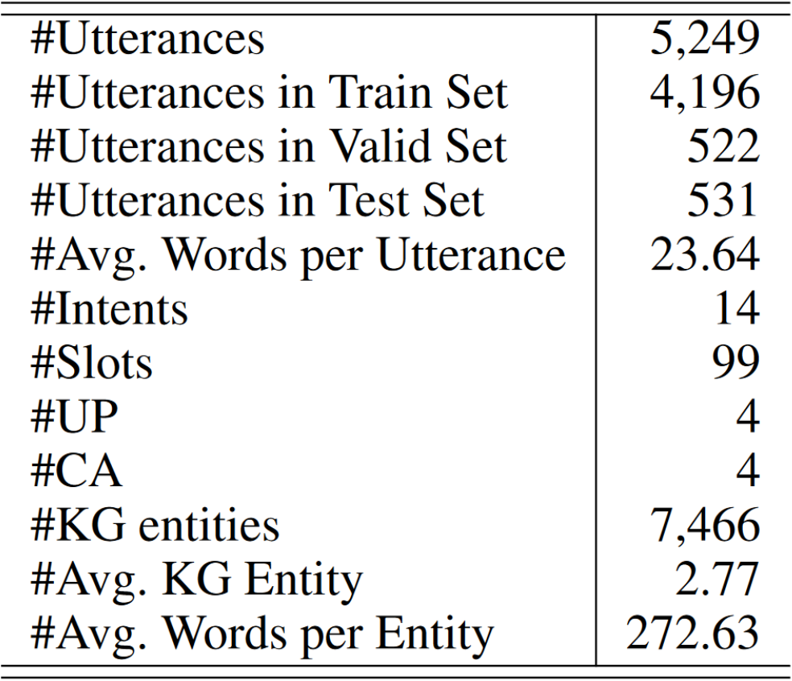
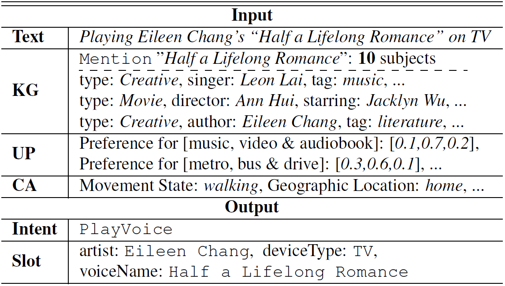
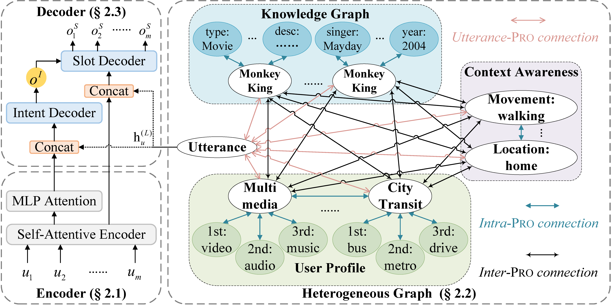
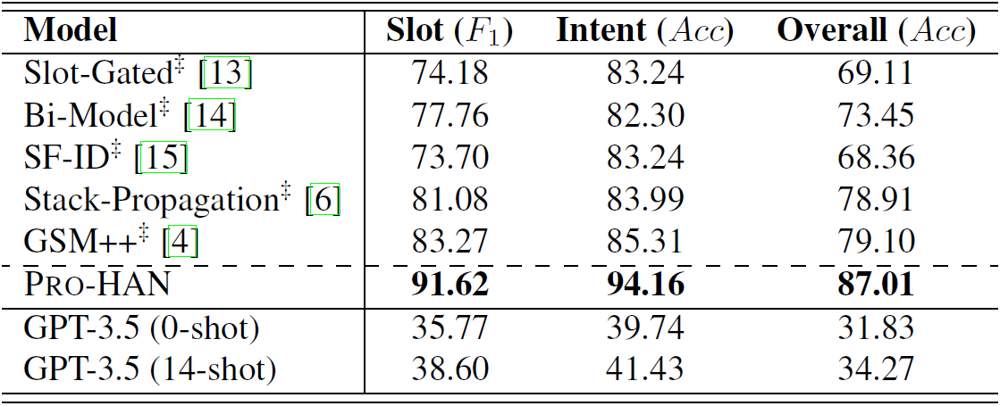

# Pro-HAN

This repository contains the official `PyTorch` implementation of the paper:

**Pro-HAN: A Heterogeneous Graph Attention Network for Profile-Based Spoken Language Understanding**.

Dechuan Teng, Chunlin Lu, [Xiao Xu](https://looperxx.github.io/), [Wanxiang Che](http://ir.hit.edu.cn/~car/) [Libo Qin](https://faculty.csu.edu.cn/qinlibo/zh_CN/index.htm).

***ICASSP 2024***.

[//]: # ([[Paper&#40;Arxiv&#41;]]&#40;&#41; [[Paper]]&#40;&#41;)

In the following, we will guide you how to use this repository step by step.

## Dataset
Below is the statistics of [ProSLU](https://github.com/LooperXX/ProSLU) dataset and an example of the data.
<div align="center">
  
  &nbsp;&nbsp;&nbsp;&nbsp;&nbsp;&nbsp;&nbsp;&nbsp
  
</div>

## Model Architecture
<div align=center>
  
</div>

## Results
<div align=center>
  
</div>

## Preparation

Our code is based on the following packages:

- python==3.11.3
- orjson==3.9.10
- numpy==1.25.0
- fitlog==0.9.15
- pytorch==2.0.1
- transformers=4.29.2
- [dgl==1.1.1+cu118](https://www.dgl.ai/pages/start.html)

We highly suggest you using [Anaconda](https://www.anaconda.com/) to manage your python environment.

## How to Run it

### Data Preparation
You first need to convert **[original data](https://github.com/LooperXX/ProSLU/tree/master/data/ProSLU)** into the format that our model can use. We provide the script **[enrich_ProSLU_data.py](utils/enrich_ProSLU_data.py)** to do this. You can run the following command to convert the data.
```Shell
python utils/enrich_ProSLU_data.py
```
After running the command, you will get the processed files **[train/dev/test]_rebuild.json** in the folder **data/ProSLU**.

### Training
The script **[main.py](main.py)** acts as a main function to the project, you can train the model from scratch by running the following command:
```Shell
DGLBACKEND=pytorch python main.py -g -fs -es -uf -ui -bs 16 -wd 1e-6 -lr 0.001 -dr 0.2 -lsf 0.5 -lsp 5 -nehd 128 -nahd 128 -kgntr 'encode_bow' -spntr 'embed_bow' -uppgn -kgirge -upirpe -cairse -kgup -kgca -upca -uttpf 'leaf' -has 'sample_weight' -iuw 'node_aggregation'
```
And we also provide the **[best model](https://drive.google.com/file/d/1jb7oZYk39KavVYQyUjT4pDV3PSNP3hbh/view?usp=sharing)** saved.
Download and unzip it into the `save` folder.

### Evaluation
You can evaluate the trained model by running the following command:
```Shell
load_dir="save/SLU+HEG/True_LSTM_wlp=False_16_lrs=0.5-5_U=0.2-0.001-1e-05-64_G=0.2-128-128_2023-08-14 112531/model"
DGLBACKEND=pytorch python main.py -de -ld "${load_dir}" -g -uf -has 'sample_weight'
```

## Issues/PRs/Questions 
If you have any question, please issue the project or email [me](mailto:dcteng@ir.hit.edu.cn), and we will reply you soon.

## Acknowledgements
- Our codes are partially inspired by Stack-Propagation, ProSLU, and KoK-HAN!
  > A Stack-Propagation Framework with Token-Level Intent Detection for Spoken Language Understanding. Libo Qin,Wanxiang Che, Yangming Li, Haoyang Wen and Ting Liu. *(EMNLP 2019)*. Long paper. [[pdf]](https://www.aclweb.org/anthology/D19-1214/) [[code]](https://github.com/LeePleased/StackPropagation-SLU)

  > Text is no more Enough! A Benchmark for Profile-based Spoken Language Understanding. *(AAAI 2022)*. Long paper. [[pdf]](https://ojs.aaai.org/index.php/AAAI/article/view/21411) [[code]](https://github.com/LooperXX/ProSLU)
   
  > Towards Complex Scenarios: Building End-to-end Task-oriented Dialogue System across Multiple Knowledge Bases. *(AAAI 2023)*. Long paper. [[pdf]](https://ojs.aaai.org/index.php/AAAI/article/view/26581) [[code]](https://github.com/RaleLee/KoK-HAN)

  
- We also thank for the open-source GNN Library [DGL](https://github.com/dmlc/dgl).

[//]: # (## Citation)

[//]: # ()
[//]: # (If you use the source codes in this repository, please cite our paper.)

[//]: # ()
[//]: # (The bibtex is listed below:)

[//]: # ()
[//]: # (```)

[//]: # ()
[//]: # (```)
